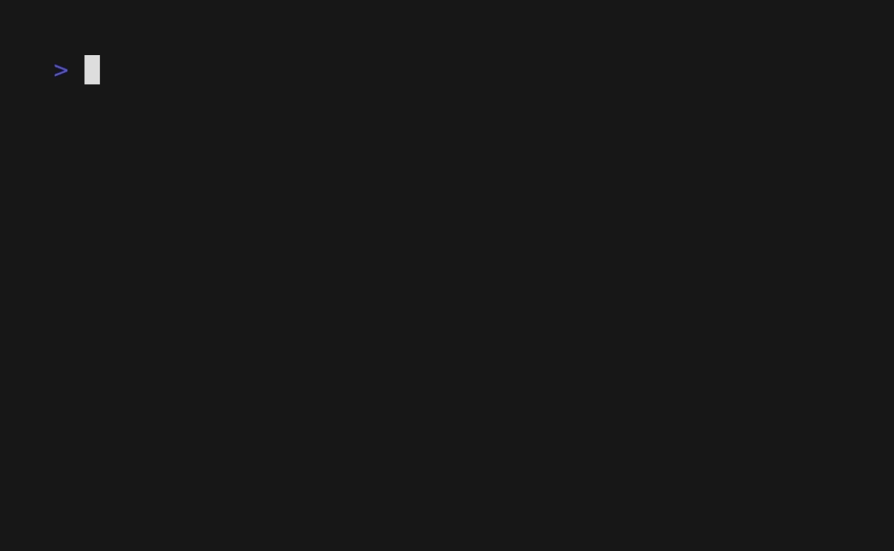

# todo.sh

Basic todo list made with bash.



## Usage

```
todo.sh                                 List todos
todo.sh -a "Read the f*cking manual"    Add a todo
todo.sh -u 1                            Toggle todo #1 state
todo.sh -s 2 3                          Switch todo #2 with todo #3
todo.sh -rm 1                           Remove todo #1
```

## Use multiple data files

If you prefer to use a different file for every todo list you create, the CLI has a built in variable to handle external configuration. By setting the `TODOSH_DATE_FILE` environment variable, you can easily switch between todo lists. For example, you can update your `.bashrc` with the following lines for two separate todo lists:

```bash
alias todo-family="TODOSH_DATA_FILE=~/Documents/todo-family.txt todo.sh"
alias todo-school="TODOSH_DATA_FILE=~/Documents/todo-school.txt todo.sh"
```

With the configuration in the above example, you can quickly switch between todo lists by using a different command. Thus you could update one of your family todos with `todo-family -u 4` or add a todo to your school todos with `todo-school -a "Finish my assignment"`.

